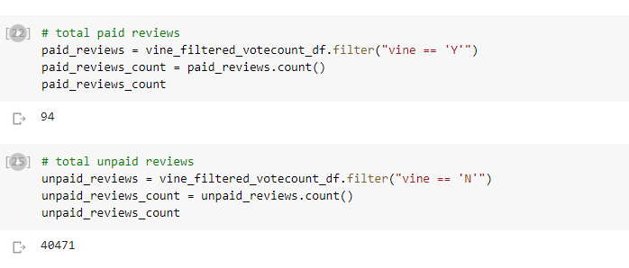
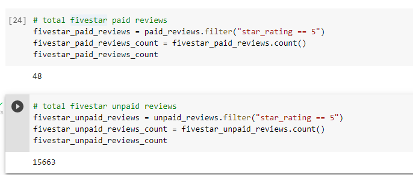
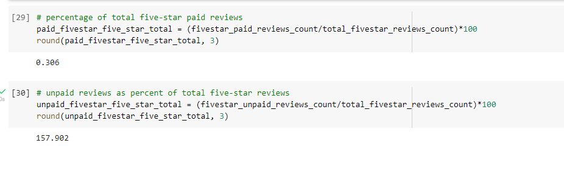

# Overview of the analysis

The Amazon Vine program is a service that allows manufacturers and publishers to receive reviews for their products. A lot of companies
pay a small fee to Amazon and provide products to Amazon Vine members, who are then required to publish a review.

In this project, we'll have access to approximately 50 datasets. Each one contains reviews of a specific product, from clothing apparel to 
wireless products. We need to pick one dataset and I have picked the dataset with video games reviews. I have used PySpark to perform the ETL 
process to extract the dataset, transform the data, connect to an AWS RDS instance, and load the transformed data into pgAdmin.

# Results

- How many Vine reviews and non-Vine reviews were there?
  
  Total Vine reviews were 94 and total non-Vine reviews were 40471.
  
  

- How many Vine reviews were 5 stars? How many non-Vine reviews were 5 stars?
   
  Total 5 stars Vine reviews were 48 and the 5 stars non-Vine reviews were 15663.
  
  

- What percentage of Vine reviews were 5 stars? What percentage of non-Vine reviews were 5 stars?
  
  The percentage of 5 stars Vine reviws was 0.306 and the percentage of 5 stars non-Vine reviws was 158
  
  
  
# Summary

- According to the analysis there doesn't seem to be any biasness from the reviews in the Vine program
- An additional analysis to perform could be finding the measures of central tendency on the star ratings. This will help us find out if 
  there are any outliers.